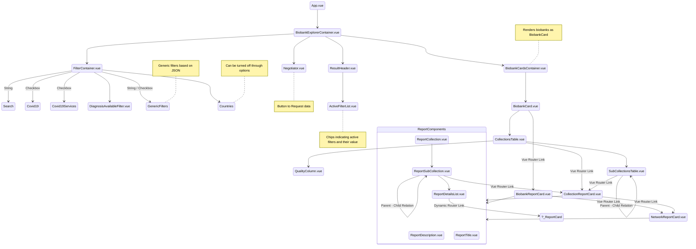

# Component architecture

# Store architecture

## Getters

### Biobank
The biobank getter has two return types:
First it returns a string array with biobank ids, which then can be accessed in the biobankcardscontainer.vue
which triggers loading of the biobank objects.

## State

### collectionIds

This is actually a form of dictionary that has object with a collectionId and a biobankId
which is being filtered, based on what the user has selected

### biobankIds

Some specific filters are on biobanks, this property is being used for that.
e.g. covid19

# 3rd party components

- vue-loading-overlay { spinner }
- vue-multiselect
- vue-analytics
- bootstrap-vu
- array-flat-polyfill

# Tools used to create this document

- Visual Studio Code

- https://mermaid-js.github.io/mermaid/#/README

- https://marketplace.visualstudio.com/items?itemName=bierner.markdown-mermaid

## Create SVG for diagram

Copy the diagram without the code block to an mmd file, then run the mermaid cli

- https://github.com/mermaidjs/mermaid.cli