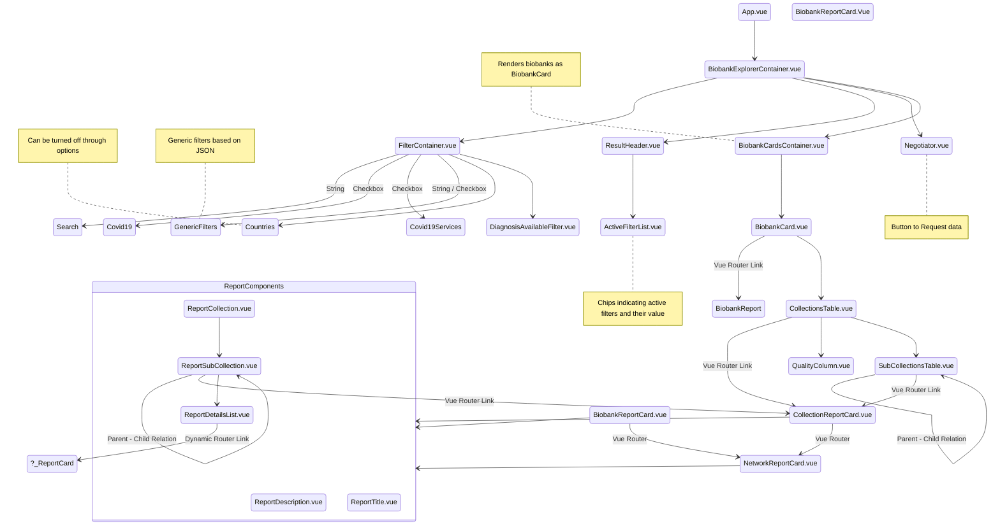

# Main architecture

## 3rd party components

### Spinner
- vue-loading-overlay

### Tools used to create this document

- Visual Studio Code

- https://mermaid-js.github.io/mermaid/#/README

- https://marketplace.visualstudio.com/items?itemName=bierner.markdown-mermaid